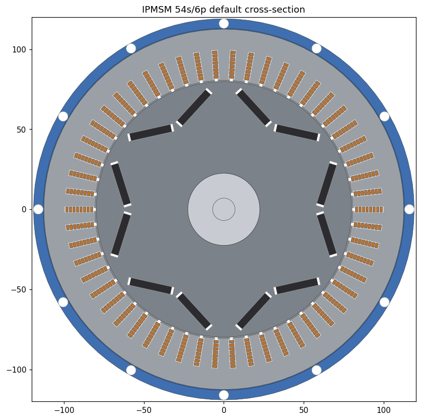

# motor_nx — Parametric EV Traction IPMSM generator for Siemens NX

Otomasyon + parametrik bir **iç mıknatıslı senkron motor** (IPMSM) üreteci. Elektrikli
araç traksiyon motorunu (radyal akı, V-mıknatıs, hairpin sargı) tek bir parametre
setinden tam otomatik olarak Siemens NX'te katı modele dönüştürür ve STEP/Parasolid
olarak dışa aktarır — başsız (headless) `run_journal.exe` batch akışında.



> 54 oluk / 6 kutup, q=3, hairpin sargı (oluk başına 8 bar), kutup başına tek V
> (2 NdFeB mıknatıs), su soğutmalı ceket — Tesla Model 3 arka tahrik sınıfı.

---

## Mimari

`tarik_xluuv_generator`'daki kanıtlanmış **params → saf-matematik blueprint → CAD
builder** ayrımının Siemens NX'e taşınmış hâli:

| Katman | Dosya | NX'e bağımlı mı? | Görevi |
|---|---|---|---|
| Parametreler | [motor_nx/params.py](motor_nx/params.py) | Hayır | Tüm tasarım girdileri (sweep dostu dataclass'lar, JSON I/O) |
| Boyutlandırma | [motor_nx/em_design.py](motor_nx/em_design.py) | Hayır | Türetilmiş geometri, sargı faktörleri, **tasarım doğrulaması** |
| Blueprint | [motor_nx/blueprint.py](motor_nx/blueprint.py) | Hayır | Saf-matematik geometri → sıralı CAD "build step" listesi + JSON |
| Önizleme | [motor_nx/preview.py](motor_nx/preview.py) | Hayır | NX'siz SVG kesit (görsel doğrulama) |
| İmalat | [motor_nx/manufacturing.py](motor_nx/manufacturing.py) | Hayır | Geometriden BOM (kütle/adet/maliyet) + GD&T tolerans + **bağlantı-elemanı (donanım) listesi** + eksantriklik yığılımı |
| Analiz | [motor_nx/analysis.py](motor_nx/analysis.py) | Hayır | Birinci-mertebe kayıp/termal/demag/rotor-gerilme/cogging analizleri |
| Resimler | [motor_nx/drawings.py](motor_nx/drawings.py) | Hayır | GD&T çerçeveli ölçülü 2D imalat resimleri (DXF + SVG): montaj / stator / rotor / şaft / patlatılmış montaj |
| FEA | [motor_nx/fea.py](motor_nx/fea.py) | Hayır | FEA hand-off paketi (spec JSON + DXF + sargı haritası) |
| NX builder | [motor_nx/nx_builder.py](motor_nx/nx_builder.py) | **Evet** | NXOpen Python ile build step'leri NX'te modele çevirir + export |
| Batch sürücü | [batch_build.py](batch_build.py) | Hayır | run_journal.exe'yi sürer; parametre süpürme + manifest |
| CLI | [motor_nx/cli.py](motor_nx/cli.py) | Hayır | report / validate / blueprint / preview / bom / tolerances / hardware / drawings / fea / analysis |

`params`, `em_design`, `blueprint`, `preview`, `manufacturing`, `fea` düz CPython ile
çalışır ve tamamen test edilebilir. Yalnızca `nx_builder` `NXOpen`'ı import eder; bu
yüzden o, NX içinde `run_journal.exe` ile çalıştırılır.

---

## Hızlı başlangıç (NX gerektirmez)

```bash
# Tasarım özeti + doğrulama
python -m motor_nx.cli report

# Geometriyi görsel doğrula (SVG kesit)
python -m motor_nx.cli preview -o preview.svg

# NX builder'ın tükettiği blueprint JSON'u üret
python -m motor_nx.cli blueprint -o blueprint.json

# İmalat: malzeme listesi (BOM) + GD&T tolerans şeması + bağlantı-elemanı listesi
python -m motor_nx.cli bom --csv bom.csv
python -m motor_nx.cli tolerances --csv tol.csv
python -m motor_nx.cli hardware --csv hw.csv   # civata/kama/segman/rulman/keçe...
python -m motor_nx.cli dfm                     # DFM Monte Carlo: hava-aralığı eksantriklik Cpk'sı

# 2D imalat resimleri (DXF + SVG): montaj / stator / rotor / şaft / patlatılmış montaj
python -m motor_nx.cli drawings -o drawings/

# TÜM imalat paketi tek klasörde (BOM+donanım+tolerans+DFM+5 çizim+Markdown özet)
python -m motor_nx.cli package -o manufacturing/

# Birinci-mertebe analizler: kayıp / termal / demag / rotor-gerilme / cogging
python -m motor_nx.cli analysis

# FEA hand-off paketi (spec + DXF + sargı haritası)
python -m motor_nx.cli fea -o fea/

# Geometri + imalat matematiği testleri
python tests/test_blueprint.py
python tests/test_manufacturing.py
```

Özel bir tasarım için kısmi bir `MotorParams` JSON'u verin:

```bash
python -m motor_nx.cli report configs/my_design.json
```

## NX'te build (headless batch — hedef NX 2506)

1. **Önce smoke test** (tek seferlik, API'yi NX 2506'da doğrular):
   ```bat
   "C:\Program Files\Siemens\NX2506\NXBIN\run_journal.exe" motor_nx\nx_smoketest.py -args C:\temp\nx_smoke > smoke.log 2>&1
   ```
   `smoke.log`'da `SMOKE TEST PASSED` görmelisiniz (bkz. [docs/NX_AUTOMATION.md](docs/NX_AUTOMATION.md)).

2. NX kurulumunuzu gösterin (config'lerde `nx_root` zaten NX2506'ya ayarlı):
   ```bat
   set UGII_ROOT_DIR=C:\Program Files\Siemens\NX2506\NXBIN
   set SPLM_LICENSE_SERVER=28000@lisans-sunucu
   ```

3. Tek motor:
   ```bash
   python batch_build.py configs/default.json
   ```

4. Parametre süpürme (stack × mıknatıs genişliği + 8-kutup varyantı):
   ```bash
   python batch_build.py configs/sweep_example.json
   ```

Her geçerli varyant için `build/` altında `<ad>.prt`, `<ad>_ap242.stp`, `<ad>.x_t`,
`<ad>.log` ve bir `manifest.json` üretilir. **Geçersiz** varyantlar (doğrulamadan
geçmeyen) NX'e hiç gönderilmeden raporlanıp atlanır.

NX kurulu değilken bile `--dry-run` tüm blueprint'leri + doğrulamayı üretir:

```bash
python batch_build.py configs/sweep_example.json --dry-run
```

Tek bir journal'ı elle de çalıştırabilirsiniz (export varsayılanı **`step`** = AP242,
güvenilir; `.prt` + `.stp` üretir):

```bat
"%UGII_ROOT_DIR%\run_journal.exe" motor_nx\nx_builder.py -args blueprint.json out.prt
```

> **NX 2506'da BUILD DOĞRULANDI:** varsayılan motor tüm montaj/üretim özellikleriyle
> **489 katı gövde, 0 hata** kurar (2 end-shield + stub + tüm delikler/flanşlar). STEP
> export sorunsuz. **Parasolid `.x_t` opt-in'dir** (`... out.prt both`) ve bazı NX
> kurulumlarında çevirmen hatası verip oturumu bozabilir → atlanır, STEP tam montajı
> taşır. `.x_t` gerekiyorsa NX GUI'den (File → Export → Parasolid) alın. Modeler hatası
> görürseniz bir sonraki build'den önce **NX'i yeniden başlatın**.

---

## Parametreyi değiştirme

Tüm tasarım [motor_nx/params.py](motor_nx/params.py)'deki dataclass'lardan gelir.
İki yol:

- **Kodda:** `MotorParams()` örneğinin alanlarını düzenleyin veya
  `params.overridden(**{"rotor.magnet_width": 28, "stack_length": 150})`.
- **JSON'da:** config'in `base` / `sweep` / `variants` bölümleri (bkz.
  [configs/sweep_example.json](configs/sweep_example.json)).

`em_design.validate()` her build'den önce geometrik olarak imkânsız kombinasyonları
(negatif kalınlık, kutbu aşan mıknatıs, sığmayan iletken, …) yakalar.

## Montaj / üretim özellikleri

3D model yalnız EM-aktif gövdeleri değil, **profesyonel montaj/üretim özelliklerini**
de içerir (varsayılan açık; `assembly.enabled` ile kapatılır): stator tie-rod/bağlama
delikleri + dönmez OD kaması, rotor balans/perçin delikleri, **şaft çıkış stub'ı** + kama
yuvası (DIN 6885) + segman kanalı (DIN 471) + içi-boş-şaft yağ delikleri, gövde montaj
flanşı + civata daireleri (şanzıman + uç-kalkan) + soğutucu giriş/çıkış portları +
terminal geçişi (+ boss) + kaldırma deliği, ve **end-shield'ler (DE+NDE rulman kapakları)
ayrı parça olarak**. Her özellik parametriktir (sayı/boyut 0 → kapalı) ve **build'den önce
geometrik olarak doğrulanır** (`em_design.validate`); varsayılan motor NX 2506'da
**486 katı gövde, 0 hata** ile build-doğrulandı. Bağlantı-elemanı listesi `cli hardware`,
DFM eksantriklik yetkinliği `cli dfm`, tüm paket `cli package`. Tam katalog +
parça-parça şartname: [project_details/](project_details/).

Belgeler:

- [project_details/](project_details/) — **insan + yapay zekâ için düz-metin proje anlatımı** (genel bakış, mimari, parça-parça şartname, montaj özellikleri kataloğu)
- [docs/DESIGN.md](docs/DESIGN.md) — tasarım gerekçesi + parametre tablosu
- [docs/NX_AUTOMATION.md](docs/NX_AUTOMATION.md) — NXOpen otomasyon (NX 2506) referansı
- [docs/MANUFACTURING.md](docs/MANUFACTURING.md) — BOM + GD&T toleranslar + imalat süreci
- [docs/FEA_PREP.md](docs/FEA_PREP.md) — FEA doğrulama planı + kabul kriterleri
- [docs/FEA_HOWTO.md](docs/FEA_HOWTO.md) — gerçek FEA nasıl/hangi programla (FEMM/Maxwell/Motor-CAD)
- [docs/PROJECT_PLAN.md](docs/PROJECT_PLAN.md) — **uçtan uca yürütme planı** (FEA → iterasyon → imalat, 12 faz)
- [docs/AUDIT.md](docs/AUDIT.md) — derin denetim bulguları + çözüm durumu (62 bulgu, 2 tur)
- [verification/README.md](verification/README.md) — **P1 Motor-CAD (PyMotorCAD) + P6 NX Drafting sürücüleri** (fea/ paketini koşar, kabul kapısına puanlar)
- [PROJECT_MEMORY/](PROJECT_MEMORY/) — proje ilerleme günlüğü
